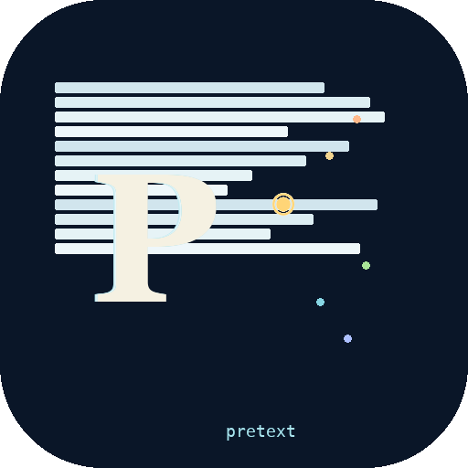

<p align="center">
  
</p>

# Mobile-Pretext

Native iOS & Android ports of [pretext](https://github.com/chenglou/pretext) — pure-arithmetic text measurement & layout without triggering native layout passes.

## What is this?

Pretext computes paragraph height and line breaks using only cached font metrics and arithmetic — without triggering expensive native layout passes like `UITextView.sizeThatFits()` or `StaticLayout`. You still use native views to render text, but measurement happens instantly via pure math.

**Two-phase architecture:**
1. `prepare(text, font)` — one-time text analysis + measurement
2. `layout(prepared, maxWidth, lineHeight)` — pure arithmetic, no platform calls

## Quick Start

<details open>
<summary><b>iOS</b> — Swift Package, measures with CoreText, segments words with NLTokenizer</summary>

```swift
import Pretext

let font = FontSpec(name: "Helvetica Neue", size: 16)
let prepared = Pretext.prepare("Hello 春天到了 🚀", font: font)
let result = Pretext.layout(prepared, maxWidth: 300, lineHeight: 22)
// result.lineCount, result.height — no UIKit layout triggered
```

</details>

<details>
<summary><b>Android</b> — Kotlin library, measures with TextPaint, segments words with ICU BreakIterator, integrates with Jetpack Compose</summary>

```kotlin
import com.pretext.*
import com.pretext.android.*

Pretext.setSegmenter(IcuTextSegmenter())
val prepared = Pretext.prepare("Hello 春天到了 🚀", PaintTextMeasurer(paint))
val result = Pretext.layout(prepared, maxWidth = 300f, lineHeight = 22f)
// result.lineCount, result.height — no StaticLayout triggered
```

</details>

## API

| Function | Purpose |
|----------|---------|
| `prepare(text, font)` | One-time analysis + measurement → opaque handle |
| `layout(prepared, maxWidth, lineHeight)` | Pure arithmetic → `{ lineCount, height }` |
| `prepareWithSegments(text, font)` | Rich variant exposing segment data |
| `layoutWithLines(prepared, maxWidth, lineHeight)` | All lines with text + width + cursors |
| `walkLineRanges(prepared, maxWidth, onLine)` | Line widths without string materialization |
| `layoutNextLine(prepared, cursor, maxWidth)` | Variable-width iterator (text around floats) |
| `clearCache()` | Reset measurement caches |
| `setLocale(locale)` | Retarget word segmenter |

## Features

- All languages: Hebrew, Arabic, Chinese, Japanese, Korean, Thai, Hindi, Myanmar, and more
- Emoji support with correct width measurement
- Soft hyphens, non-breaking spaces, zero-width spaces
- Pre-wrap mode for editor-like text (preserves spaces, tabs, newlines)
- Bidirectional text support for mixed LTR/RTL rendering
- Variable-width line layout (text around floated images)

## Sample Apps

Each platform includes a single sample app with five demo sections:

| Demo | What it shows |
|------|---------------|
| **Height Measurement** | Live slider changes width, height updates instantly |
| **Line Breaking** | Per-line visualization via `layoutWithLines()` |
| **Multi-Language** | Hebrew, Arabic, Chinese, Japanese, Korean, Thai, Emoji, mixed LTR/RTL, soft hyphens |
| **Variable Width** | Text flowing around obstacles via `layoutNextLine()` |
| **Performance** | `prepare()` vs `layout()` timing comparison |

<details open>
<summary><b>iOS</b> — run the sample app</summary>

```sh
open ios/SampleApp/PretextDemo.xcodeproj
```
Select your iPhone, set your development team in Signing & Capabilities, and hit Run.

</details>

<details>
<summary><b>Android</b> — run the sample app</summary>

```sh
cd android && studio .
```
Open in Android Studio, run the `sample-app` module.

</details>

## Architecture

<details open>
<summary><b>iOS</b></summary>

```
ios/
├── Package.swift
├── Sources/Pretext/       # 8 source files
│   ├── Analysis.swift     # Segmentation, normalization, merge rules
│   ├── Measurement.swift  # CoreText measurement + cache
│   ├── LineBreak.swift    # Line-walking engine (fast + full paths)
│   ├── Bidi.swift         # Simplified Unicode Bidi Algorithm
│   ├── CJK.swift          # CJK detection, kinsoku tables
│   ├── Segmentation.swift # NLTokenizer word segmentation
│   ├── Types.swift        # Public + internal types
│   └── Pretext.swift      # Public API entry point
├── Tests/PretextTests/
└── SampleApp/             # SwiftUI demo (5 demo sections)
```

</details>

<details>
<summary><b>Android</b></summary>

```
android/
├── pretext-core/          # Pure Kotlin (testable on JVM, no Android dep)
│   ├── analysis/          # Segmentation, normalization, merge rules
│   ├── measurement/       # Cache layer
│   ├── linebreak/         # Line-walking engine (fast + full paths)
│   └── bidi/              # Simplified Unicode Bidi Algorithm
├── pretext-android/       # TextPaint + ICU BreakIterator
├── pretext-compose/       # PretextText composable
└── sample-app/            # Compose demo (5 demo sections)
```

</details>

## License

Code is [MIT](LICENSE). Icon files are All Rights Reserved (see [LICENSE](LICENSE)).
